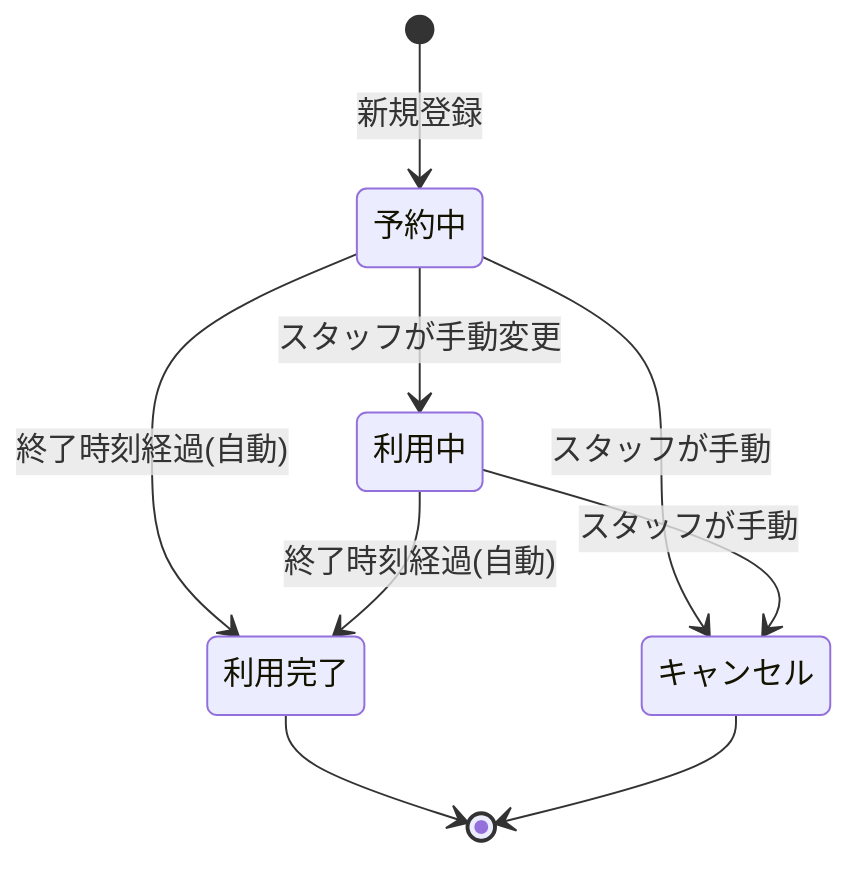
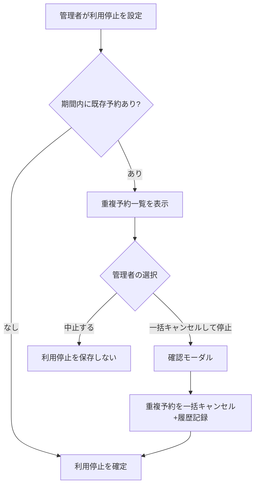

# 02. 業務ルール・ステータス遷移仕様書

## 1. 施設マスター

初期6施設。管理者は将来的に施設を追加できる。

| 施設ID(例) | 施設名 | カテゴリ | 固定利用時間 | 清掃機能 |
|---|---|---|---|---|
| karaoke-101 | カラオケ101 | カラオケ | 90分 | なし |
| karaoke-102 | カラオケ102 | カラオケ | 90分 | なし |
| ganban-laut | 岩盤浴 LAUT | 岩盤浴 | 60分 | あり |
| ganban-gunung | 岩盤浴 GUNUNG | 岩盤浴 | 60分 | あり |
| pj | PJ | その他 | 120分 | なし |
| laundry | ランドリー | その他 | 300分 | なし |

全施設無料、定員管理不要。

施設マスター管理項目:施設ID、施設名、カテゴリ、固定利用時間、表示順、表示色、清掃機能有無、説明、管理者向け備考、有効/無効、作成日時、更新日時。

**削除方針**:施設は物理削除しない。「無効化」のみとし、無効化した施設は新規予約対象外だが過去の予約履歴には表示され続ける。

## 2. 部屋番号マスター

初期58室(301〜308, 401〜410, 501〜510, 601〜610, 701〜710, 801〜804, 901〜903)をマスターとして管理する。検索可能なセレクトUIで選択する。将来的な追加・無効化に対応するため、ハードコードせずテーブルで管理する。無効化された部屋番号は新規予約の選択肢から除外するが、過去予約の表示は維持する(施設マスターと同じ論理削除方針)。

## 3. 予約者区分

| 区分 | 入力項目 |
|---|---|
| 宿泊中 | 部屋番号(選択式、氏名入力なし) |
| チェックイン前 | 氏名(入力、部屋番号なし) |
| チェックアウト後 | 氏名(入力、部屋番号なし) |

選択した区分に応じて入力欄を動的に切替える。

## 4. 予約入力項目

- 予約者区分
- 部屋番号 または 氏名
- 利用施設
- 利用開始日(カレンダーUI)
- 利用開始時刻(15分刻みの選択式。自由入力不可)
- 利用終了日時(自動計算、原則編集不可)
- 備考(任意)

終了日時は「施設の固定利用時間」を開始日時に加算して自動計算する。日付をまたぐ場合も同様に計算する(例:ランドリー 7/20 22:00開始 → 7/21 3:00終了)。

## 5. 予約可能期間

現在日時を基準に「当日を含め設定日数先まで」を予約可能とする。設定値は `system_settings` に `reservation_window_days`(初期値3)として保持し、**管理画面から数値変更できるようにする**(承認済み)。

例:設定値3、本日7/20の場合 → 7/20, 21, 22, 23 が予約可能。

予約締切・キャンセル期限はなし。開始直前でも予約可能、開始後でも権限があればキャンセル可能。

## 6. 営業日と時刻

施設は24時間予約可能。1日の区切りは00:00〜23:59。日付をまたぐ予約を許可し、予約表上で視覚的に区別する(具体的な表示方法は [04-screen-specification.md](04-screen-specification.md) で複数案を提示)。

## 7. 重複予約防止

同一施設内で利用時間が重なる予約は登録できない。

```
newStart < existingEnd AND newEnd > existingStart
```

- キャンセル済み予約は重複判定の対象外。
- 判定は新規予約・時間変更・施設変更・ドラッグ&ドロップ移動・複数スタッフ同時操作・管理者操作の**すべて**で行う。
- フロントエンドの入力チェックに加え、**データベース側(PostgreSQL EXCLUDE制約)でも重複を確定的に防止**する(詳細は [05-database-design.md](05-database-design.md))。
- 施設利用停止期間中は新規予約を登録できない。
- 重複時は日本語で分かりやすいメッセージを表示する。例:「選択した時間帯には、すでにカラオケ101の予約が入っています。別の時間を選択してください。」

## 8. 予約ステータス

| ステータス | 説明 | 遷移条件 |
|---|---|---|
| 予約中 | 新規登録時の初期状態 | - |
| 利用中 | 実際の利用開始をスタッフが確認して手動変更 | 予約中 → 利用中(手動のみ、自動遷移なし) |
| 利用完了 | 終了時刻経過後に自動変更 | 予約中/利用中 → 利用完了(自動、キャンセル済みは対象外) |
| キャンセル | スタッフが手動でキャンセル | 予約中/利用中 → キャンセル(手動、いつでも可) |



キャンセル済み予約は通常の予約表から非表示。予約表の「キャンセル済みを表示」トグルを有効にした場合のみ、灰色・取り消し線などで識別表示する。キャンセル履歴は削除せず、履歴画面から確認できる。

## 9. 施設稼働ステータス

| ステータス | 説明 |
|---|---|
| 予約可能 | 通常状態 |
| 清掃中 | 岩盤浴LAUT/GUNUNGのみ使用。利用完了後に自動遷移 |
| 利用停止 | 管理者のみが設定可能 |

### 9-1. 清掃中(岩盤浴専用)

- 岩盤浴の予約が「利用完了」になった時点で、対象施設は自動的に「清掃中」になる。
- 清掃中でも将来日時の予約登録自体は可能。
- 清掃完了操作は**一般スタッフ・管理者どちらも実行可能**。実行すると施設は「予約可能」に戻る。
- **改訂仕様(承認済み)**:次の予約の**開始30分前**になっても対象施設が「清掃中」の場合、予約表・通知上で「清掃を完了させてください」という警告を表示する。開始時刻を過ぎてもなお清掃中の場合は、警告表示を継続し、より強調した表示(色・アイコン)に切り替える。
- 清掃中ステータスは「新規予約登録の可否」を制限するものではなく、「施設が物理的に清掃を要する状態にある」ことを示す運用上の目印である。実際に利用開始してよいかどうかの最終判断は現場スタッフが行う。

### 9-2. 利用停止(管理者専用・簡略化フロー)

利用停止設定項目:停止開始日時、停止終了日時、終了日時未定フラグ、停止理由、登録した管理者、登録日時。

利用停止期間中は新規予約を登録できない。

**改訂フロー(承認済み)**:利用停止期間と重複する既存予約がある場合、管理者は以下の2択のみを選べる(「既存予約を残す」の選択肢は廃止)。

1. **利用停止処理を中止する**(既存予約を優先し、停止設定を保存しない)
2. **重複する既存予約を一括キャンセルして利用停止にする**(確認モーダル必須。実行するとキャンセル理由「施設利用停止に伴う一括キャンセル」で全件キャンセルされ、履歴に記録される)

警告画面では重複する既存予約を一覧表示したうえで、上記いずれかを選択させる。

終了日時未定で利用停止した場合は、管理者が手動で解除するまで継続する。



## 10. 予約変更

スタッフは予約者区分・部屋番号・氏名・利用施設・開始日時・備考を変更できる。施設または開始日時を変更した場合は終了日時を再計算し、変更後の時間帯で重複判定を行う。変更前後の内容は履歴に保存する。

## 11. ドラッグ&ドロップ

- 同一施設内での時間変更、別施設への移動、別日付への移動に対応する。
- いずれの移動も事前に重複チェックを行い、重複がある場合は移動を確定できない。
- 別施設への移動は必ず確認モーダルを表示する。モーダルには変更前後の施設・開始/終了日時・予約者情報を表示する。
- 別施設移動時は移動先施設の固定利用時間で終了日時を再計算する。
- タブレットでの誤操作防止のため、長押しで掴んでから移動し、離した時点で確認モーダルを表示する操作方式を採用する(承認済み。詳細は [04-screen-specification.md](04-screen-specification.md))。

## 12. スタッフ操作一覧(まとめ)

要件書セクション16と同一。一般スタッフ操作、管理者操作の一覧は [01-requirements.md](01-requirements.md#5-機能一覧) を参照。
