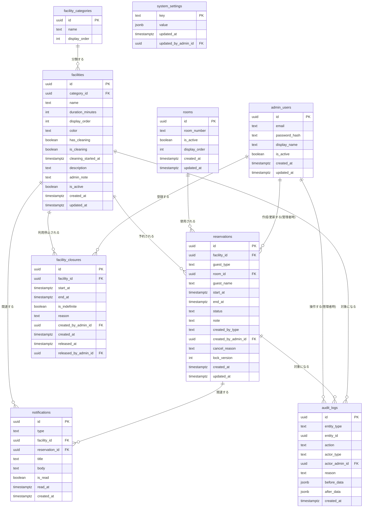

# 05. データベース設計書

DBMS:PostgreSQL(Supabase)。日時は**UTCで保存し、表示・集計時にAsia/Tokyoへ変換する**方針を採用する(理由は [11. タイムゾーン方針](#11-タイムゾーン方針)参照)。全テーブルUUID主キー(`gen_random_uuid()`)。

## 1. ER図



## 2. テーブル定義

### 2-1. facility_categories(施設カテゴリ)

| カラム | 型 | NULL | デフォルト | 制約 |
|---|---|---|---|---|
| id | uuid | NOT NULL | gen_random_uuid() | PK |
| name | text | NOT NULL | - | UNIQUE |
| display_order | int | NOT NULL | 0 | - |

初期データ:カラオケ / 岩盤浴 / その他。論理削除なし(カテゴリは運用上ほぼ固定)。

### 2-2. facilities(施設マスター)

| カラム | 型 | NULL | デフォルト | 制約 |
|---|---|---|---|---|
| id | uuid | NOT NULL | gen_random_uuid() | PK |
| category_id | uuid | NOT NULL | - | FK → facility_categories.id |
| name | text | NOT NULL | - | UNIQUE |
| duration_minutes | int | NOT NULL | - | CHECK (duration_minutes > 0) |
| display_order | int | NOT NULL | 0 | - |
| color | varchar(7) | NOT NULL | '#999999' | - |
| has_cleaning | boolean | NOT NULL | false | - |
| is_cleaning | boolean | NOT NULL | false | 清掃中フラグ(has_cleaning=trueの施設のみ意味を持つ) |
| cleaning_started_at | timestamptz | NULL | - | - |
| description | text | NULL | - | - |
| admin_note | text | NULL | - | - |
| is_active | boolean | NOT NULL | true | 論理削除フラグ(無効化) |
| created_at | timestamptz | NOT NULL | now() | - |
| updated_at | timestamptz | NOT NULL | now() | - |

インデックス:`idx_facilities_active_order (is_active, display_order)`。**論理削除あり**(is_active)。

### 2-3. rooms(部屋番号マスター)

| カラム | 型 | NULL | デフォルト | 制約 |
|---|---|---|---|---|
| id | uuid | NOT NULL | gen_random_uuid() | PK |
| room_number | text | NOT NULL | - | UNIQUE |
| is_active | boolean | NOT NULL | true | 論理削除フラグ |
| display_order | int | NOT NULL | 0 | - |
| created_at | timestamptz | NOT NULL | now() | - |
| updated_at | timestamptz | NOT NULL | now() | - |

初期データ:要件書58室。**論理削除あり**。

### 2-4. admin_users(管理者アカウント)

| カラム | 型 | NULL | デフォルト | 制約 |
|---|---|---|---|---|
| id | uuid | NOT NULL | gen_random_uuid() | PK |
| email | text | NOT NULL | - | UNIQUE |
| password_hash | text | NOT NULL | - | - |
| display_name | text | NOT NULL | - | - |
| is_active | boolean | NOT NULL | true | - |
| created_at | timestamptz | NOT NULL | now() | - |
| updated_at | timestamptz | NOT NULL | now() | - |

初期運用は1レコードのみ発行し共通利用する(→[07-auth-security.md](07-auth-security.md))。テーブル自体は複数アカウントに対応可能な設計とし、将来の個人アカウント化に備える。論理削除なし(無効化はis_active)。

### 2-5. reservations(予約)

| カラム | 型 | NULL | デフォルト | 制約 |
|---|---|---|---|---|
| id | uuid | NOT NULL | gen_random_uuid() | PK |
| facility_id | uuid | NOT NULL | - | FK → facilities.id |
| guest_type | text | NOT NULL | - | CHECK IN ('staying','before_checkin','after_checkout') |
| room_id | uuid | NULL | - | FK → rooms.id(guest_type='staying'の時のみ必須) |
| guest_name | text | NULL | - | guest_type IN ('before_checkin','after_checkout')の時のみ必須 |
| start_at | timestamptz | NOT NULL | - | - |
| end_at | timestamptz | NOT NULL | - | CHECK (end_at > start_at) |
| status | text | NOT NULL | 'reserved' | CHECK IN ('reserved','in_use','completed','cancelled') |
| note | text | NULL | - | 長さ制限(アプリ層+CHECK) |
| created_by_type | text | NOT NULL | - | CHECK IN ('staff','admin') |
| created_by_admin_id | uuid | NULL | - | FK → admin_users.id |
| cancel_reason | text | NULL | - | キャンセル時のみ |
| lock_version | int | NOT NULL | 0 | 楽観的ロック用 |
| created_at | timestamptz | NOT NULL | now() | - |
| updated_at | timestamptz | NOT NULL | now() | - |

**CHECK制約(区分整合性)**

```sql
ALTER TABLE reservations ADD CONSTRAINT chk_guest_type_fields CHECK (
  (guest_type = 'staying' AND room_id IS NOT NULL AND guest_name IS NULL)
  OR
  (guest_type IN ('before_checkin', 'after_checkout') AND guest_name IS NOT NULL AND room_id IS NULL)
);
```

**重複防止(最重要)**

```sql
CREATE EXTENSION IF NOT EXISTS btree_gist;

ALTER TABLE reservations ADD CONSTRAINT excl_reservation_overlap
  EXCLUDE USING gist (
    facility_id WITH =,
    tsrange(start_at, end_at, '[)') WITH &&
  )
  WHERE (status <> 'cancelled');
```

- `tsrange(start_at, end_at, '[)')`:開始時刻を含み終了時刻を含まない半開区間として重複判定([05-database-design.md 内]の`newStart < existingEnd AND newEnd > existingStart`と等価)。
- `WHERE (status <> 'cancelled')`:PostgreSQLの部分EXCLUDE制約により、**キャンセル済み予約は制約の対象外**になる。
- 同時に2端末が同じ枠を確定しようとした場合、後からコミットした側がこの制約違反(`23P01 exclusion_violation`)でDBレベルに拒否される。アプリ層はこのエラーを検知し、日本語メッセージへ変換する。

**楽観的ロック(編集競合検出)**

`lock_version` を更新のたびにインクリメントし、クライアントは予約詳細取得時に取得した `lock_version` を編集リクエストに含める。サーバー側は `UPDATE ... WHERE id = ? AND lock_version = ?` で更新し、0件更新だった場合は「他の端末で予約内容が変更されました。最新情報を再読み込みしてください」というエラーを返す。

インデックス:`idx_reservations_facility_start (facility_id, start_at)`、`idx_reservations_status (status)`、`idx_reservations_room (room_id)`。**論理削除なし**(キャンセルはstatusで表現、物理削除しない)。

### 2-6. facility_closures(施設利用停止期間)

| カラム | 型 | NULL | デフォルト | 制約 |
|---|---|---|---|---|
| id | uuid | NOT NULL | gen_random_uuid() | PK |
| facility_id | uuid | NOT NULL | - | FK → facilities.id |
| start_at | timestamptz | NOT NULL | - | - |
| end_at | timestamptz | NULL | - | is_indefinite=falseの場合は必須 |
| is_indefinite | boolean | NOT NULL | false | - |
| reason | text | NOT NULL | - | - |
| created_by_admin_id | uuid | NOT NULL | - | FK → admin_users.id |
| created_at | timestamptz | NOT NULL | now() | - |
| released_at | timestamptz | NULL | - | 手動解除日時 |
| released_by_admin_id | uuid | NULL | - | FK → admin_users.id |

CHECK制約:`(is_indefinite = true AND end_at IS NULL) OR (is_indefinite = false AND end_at IS NOT NULL AND end_at > start_at)`。

現在「利用停止中」かどうかは以下で判定する(アプリ層/ビューで算出):

```sql
EXISTS (
  SELECT 1 FROM facility_closures fc
  WHERE fc.facility_id = facilities.id
    AND fc.released_at IS NULL
    AND fc.start_at <= now()
    AND (fc.is_indefinite OR fc.end_at >= now())
)
```

インデックス:`idx_closures_facility_active (facility_id, released_at)`。**論理削除なし**(履歴として保持、解除はreleased_atで表現)。

### 2-7. notifications(通知)

| カラム | 型 | NULL | デフォルト | 制約 |
|---|---|---|---|---|
| id | uuid | NOT NULL | gen_random_uuid() | PK |
| type | text | NOT NULL | - | CHECK IN ('reminder_15min','cleaning_warning','facility_stopped','reservation_created','reservation_updated','reservation_cancelled') |
| facility_id | uuid | NULL | - | FK → facilities.id |
| reservation_id | uuid | NULL | - | FK → reservations.id |
| title | text | NOT NULL | - | - |
| body | text | NOT NULL | - | - |
| is_read | boolean | NOT NULL | false | 全スタッフ共通の既読フラグ |
| read_at | timestamptz | NULL | - | - |
| created_at | timestamptz | NOT NULL | now() | - |

インデックス:`idx_notifications_created (created_at DESC)`、`idx_notifications_unread (is_read)`。**重複生成防止**:15分前通知・清掃警告は、同一 `reservation_id`/`facility_id` + `type` の組み合わせで既存レコードがあれば再作成しない(冪等性)。論理削除なし。

### 2-8. audit_logs(監査ログ)

| カラム | 型 | NULL | デフォルト | 制約 |
|---|---|---|---|---|
| id | uuid | NOT NULL | gen_random_uuid() | PK |
| entity_type | text | NOT NULL | - | CHECK IN ('reservation','facility','room','facility_closure','system_setting') |
| entity_id | uuid | NOT NULL | - | - |
| action | text | NOT NULL | - | 例:create, update, cancel, status_change, cleaning_complete, bulk_cancel |
| actor_type | text | NOT NULL | - | CHECK IN ('staff','admin','system') |
| actor_admin_id | uuid | NULL | - | FK → admin_users.id(actor_type='admin'の時のみ) |
| reason | text | NULL | - | - |
| before_data | jsonb | NULL | - | - |
| after_data | jsonb | NULL | - | - |
| created_at | timestamptz | NOT NULL | now() | - |

インデックス:`idx_audit_entity (entity_type, entity_id, created_at DESC)`。**削除禁止**(アプリ層でDELETE操作を提供しない)。

### 2-9. system_settings(システム設定)

| カラム | 型 | NULL | デフォルト | 制約 |
|---|---|---|---|---|
| key | text | NOT NULL | - | PK |
| value | jsonb | NOT NULL | - | - |
| updated_at | timestamptz | NOT NULL | now() | - |
| updated_by_admin_id | uuid | NULL | - | FK → admin_users.id |

初期データ:`reservation_window_days = 3`、`time_slot_minutes = 15`、`timezone = "Asia/Tokyo"`。管理画面から `reservation_window_days` を変更可能にする(承認済み)。

## 3. 日本語エラーメッセージへの変換方針

DB制約違反(PostgreSQLエラーコード)をアプリ層で以下のようにマッピングする。

| DBエラー | 日本語メッセージ |
|---|---|
| `23P01`(exclusion_violation、重複予約) | 「選択した時間帯には、すでに{施設名}の予約が入っています。別の時間を選択してください。」 |
| 楽観的ロック不一致(0件更新) | 「他の端末で予約内容が変更されました。最新情報を再読み込みしてください。」 |
| CHECK制約違反(区分不整合など) | 対応する入力項目のバリデーションメッセージ(→[06-api-design.md](06-api-design.md)) |

## 4. マイグレーション方針

Prismaでスキーマ・マイグレーションのベースを管理しつつ、`EXCLUDE`制約や部分インデックスなどPrismaのスキーマ言語で表現できないDDLは、Prismaの `migration.sql` を手動編集(またはPrisma의 `db execute` / raw SQLマイグレーション)で追加する。この方針を [10-deployment-operation.md](10-deployment-operation.md) のマイグレーション手順に明記する。

## 5. タイムゾーン方針

DB保存はUTC(`timestamptz`型を使用し、PostgreSQL内部は常にUTCで保持)、アプリケーション層(表示・入力・集計)ではAsia/Tokyoに変換して扱う。

**理由**:`timestamptz`はタイムゾーン情報を持たず内部的にUTCで正規化して保持するPostgreSQLの標準的な型であり、将来的なサーバーやDBリージョンの変更に対しても変換ロジックが一貫する。日本国内限定・夏時間なしの運用であっても、UTC保存+アプリ層変換の方が「保存時に変換し忘れる」バグを避けやすく、Next.js/Supabaseのエコシステムとも親和性が高い。表示・15分刻み判定・予約可能期間判定などのビジネスロジックは、必ずAsia/Tokyoに変換した上で計算する(→[06-api-design.md](06-api-design.md)のバリデーション設計)。
