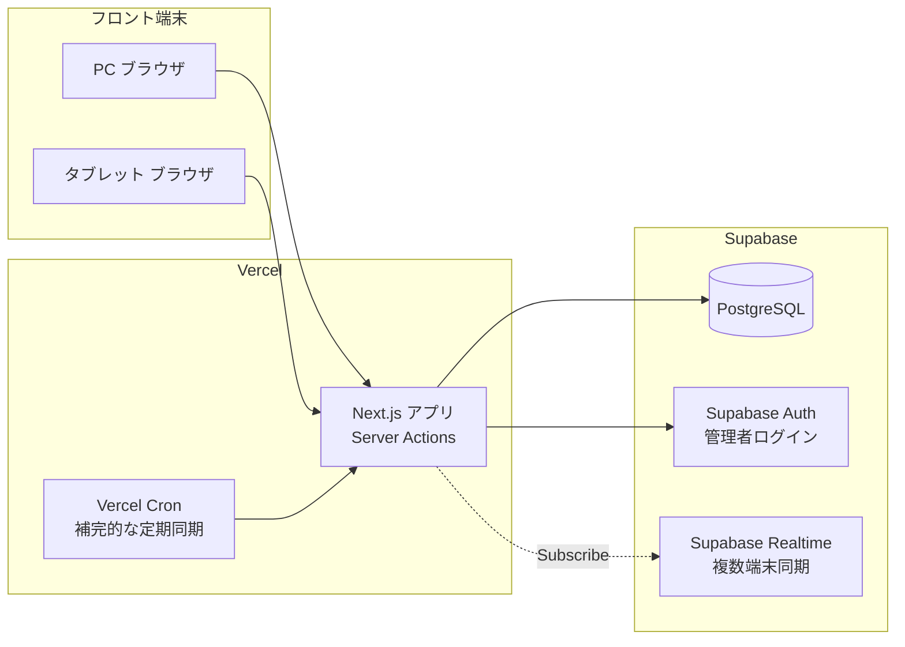

# 10. デプロイ・運用設計書 / 開発計画

## 1. システム構成



## 2. ディレクトリ構成(想定)

```
/
├── docs/                 # 本仕様書一式
├── prisma/
│   ├── schema.prisma
│   └── migrations/
├── src/
│   ├── app/
│   │   ├── staff/        # 一般スタッフ画面
│   │   ├── admin/        # 管理者画面
│   │   └── api/          # Cron/Webhook用Route Handler
│   ├── actions/          # Server Actions
│   ├── components/
│   ├── lib/               # 重複判定・日時計算等の共通ロジック
│   └── types/
├── tests/
│   ├── unit/
│   ├── integration/
│   └── e2e/
└── ...
```

具体的な構成は フェーズ4(プロジェクト初期構築)で確定し、都度ご報告する。

## 3. 環境変数(想定・値は含めない)

| 変数名 | 用途 |
|---|---|
| `DATABASE_URL` | Supabase接続文字列(本番/開発で分離) |
| `NEXT_PUBLIC_SUPABASE_URL` / `NEXT_PUBLIC_SUPABASE_ANON_KEY` | Supabaseクライアント接続 |
| `SUPABASE_SERVICE_ROLE_KEY` | サーバー側管理操作用(絶対にクライアントへ露出しない) |
| `ADMIN_SESSION_SECRET` | 管理者セッション署名鍵 |
| `STAFF_ACCESS_CODE_HASH` または DB管理 | 共通アクセスコードのハッシュ値 |
| `CRON_SECRET` | Vercel Cronからのリクエスト検証用 |

`.env`はGit管理対象外([.gitignore](../.gitignore)に設定済み)。

## 4. マイグレーション・初期データ投入

1. Prismaでスキーマ定義 → `prisma migrate dev`でマイグレーション生成
2. `EXCLUDE`制約など Prisma未対応のDDLを手動SQLで追加
3. シードスクリプトで初期データ投入:施設6件、部屋番号55件、`system_settings`初期値、管理者アカウント1件

## 5. 自動処理(Cron)設定

[03-notification-jobs.md](03-notification-jobs.md)の方針に基づき、Vercel Cronから`/api/sync`(仮)を数分〜数十分間隔で呼び出す設定を`vercel.json`に定義する。無料枠(Hobby)の実行頻度制限に応じて、必要なら無料の外部Cron(cron-job.org等)を補完的に併用する。

## 6. バックアップ・障害対応

- Supabaseの自動バックアップ機能(Point-in-Time Recovery含む、プランに応じた保持期間)を利用する。無料枠の保持期間には制限があるため、運用開始後にプラン要否を再確認する。
- 重要な障害(DB接続不可、予約登録不可等)発生時は、一般スタッフ画面に「通信に失敗しました」等のエラーメッセージを表示し、技術的詳細は表示しない。
- 復元手順・障害連絡フローは運用開始前(フェーズ15)に運用マニュアルとして別途整備する。

## 7. Vercel公開手順(概要)

1. GitHubリポジトリと連携
2. Supabase本番プロジェクト作成、環境変数をVercelに設定
3. マイグレーション実行、初期データ投入
4. 管理者アカウント作成(1件)
5. Cron設定
6. 本番動作確認(予約登録・重複防止・通知・アナリティクスなど主要導線)

## 8. 開発フェーズ計画

ご提示いただいたフェーズ1〜15の計画をそのまま採用します。**フェーズ1〜3(本ドキュメント一式)がご承認いただけた時点で、フェーズ4以降のコード実装に着手**します。

| フェーズ | 内容 |
|---|---|
| 1 | 要件定義と仕様書(本書一式) |
| 2 | UI・画面設計([04-screen-specification.md](04-screen-specification.md)、UI案の選定待ち) |
| 3 | 技術設計([05](05-database-design.md)〜[08](08-analytics.md)、本書) |
| 4 | プロジェクト初期構築(Next.js・TypeScript・Lint・DB接続・環境変数・マイグレーション・初期データ) |
| 5 | 管理者認証と権限 |
| 6 | 施設・部屋マスター |
| 7 | 予約機能(一覧・新規・変更・キャンセル・重複防止・履歴) |
| 8 | 予約表UI(選定されたUI案の実装) |
| 9 | ドラッグ&ドロップ |
| 10 | 自動ステータスと清掃 |
| 11 | 通知 |
| 12 | 施設利用停止 |
| 13 | アナリティクス |
| 14 | テストと改善 |
| 15 | Vercel公開 |

各フェーズ開始前に作業内容を説明し、終了後に変更ファイル一覧・実行コマンド・テスト結果を報告します(要件書セクション35のルールに準拠)。
